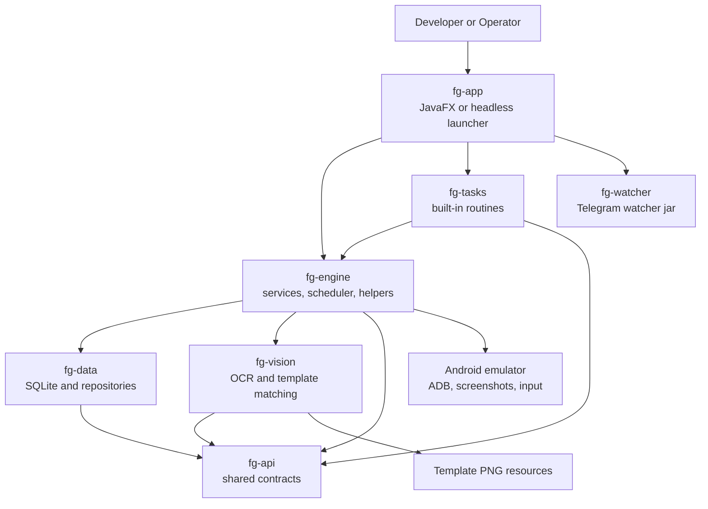
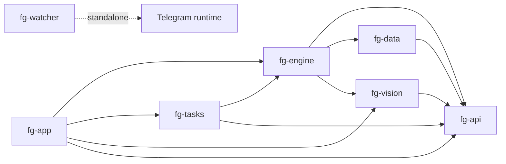
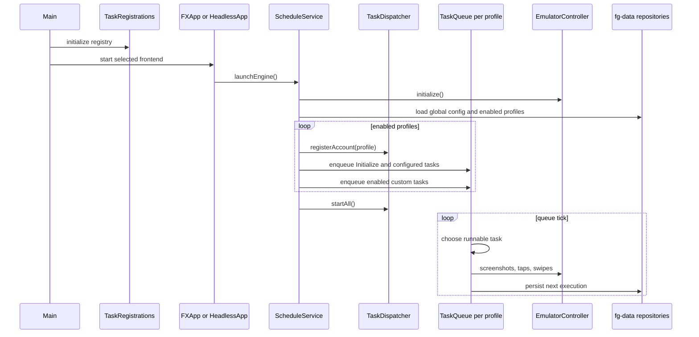
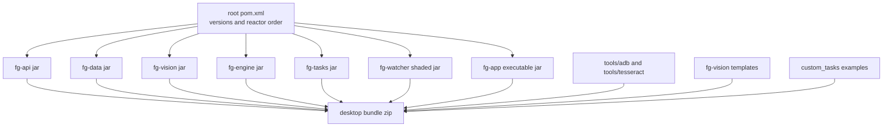

# Frostguard Architecture

This document gives a high-level map of the codebase for developers who need to find the right layer before changing behavior. Frostguard is a Java 21 multi-module Maven application that drives Android emulators for Whiteout Survival automation.

## System Blocks

The main design rule is: UI code configures and observes automation; engine code schedules and coordinates it; task code contains game-specific business behavior; vision/data modules provide lower-level capabilities.

## Dependency Direction

Dependencies should stay mostly downward:

Do not put game task business logic in `fg-app`; do not put UI concepts in `fg-engine` or `fg-tasks`.

## Logical Decomposition

### API Layer

`fg-api` contains stable cross-module contracts:

- `TpDailyTaskEnum`, `ConfigurationKeyEnum`, and related enums define task and configuration identifiers.
- `AccountDescriptor`, `TaskStateData`, `DailyTaskStatusData`, `PointData`, `AreaData`, and `ImageSearchResultData` carry state between modules.
- `TemplatesEnum` maps logical template names to classpath resources declared in `fg-api/src/main/resources/config/templates.properties`.

Use this module for shared data shapes only. It should not depend on services, JavaFX, repositories, or emulator code.

### Data Layer

`fg-data` owns persistence:

- `DataStore` and `DataSeeder` initialize the SQLite/Hibernate runtime.
- `Profile`, `Config`, `DailyTask`, and related entities model persisted state.
- `ProfileRepository`, `ConfigRepository`, and `DailyTaskRepository` expose repository operations.

Engine services are the normal callers. UI controllers should prefer engine services over direct repository access.

### Vision Layer

`fg-vision` owns low-level image and OCR primitives:

- `OpenCvPatternLocator` loads OpenCV and performs template matching.
- `TesseractOcrProvider` integrates Tess4J/Tesseract.
- `ResilientOcrExecutor` adds retry and validation behavior around OCR extraction.
- PNG templates live under `fg-vision/src/main/resources/templates`.

Task-facing code should usually call `TemplateSearchHelper` or `BotOcrEngine` from `fg-engine`, not raw vision utilities directly.

### Engine Layer

`fg-engine` is the application core:

- `ScheduleService` starts/stops automation, loads profiles/configuration, restores schedules, and publishes bot/queue state.
- `TaskDispatcher` owns per-profile `TaskQueue` instances and starts queue threads.
- `TaskQueue` selects ready tasks, executes them, records task state, handles rescheduling, and manages preemption.
- `DelayedTask` is the base class for all Java automation tasks.
- Helper classes such as `NavigationHelper`, `MarchHelper`, `StaminaHelper`, and `TemplateSearchHelper` provide reusable game operations.
- Services such as `ProfileService`, `ConfigService`, `TaskManagementService`, `LoggingService`, and `StatisticsService` coordinate shared state.
- `EmulatorController` is the gateway for ADB/device actions, screenshots, taps, swipes, process checks, and emulator lifecycle operations.

### Task Layer

`fg-tasks` contains game-specific routines grouped by domain:

- `alliance`, `city`, `combat`, `dailies`, `economy`, `events`, `exploration`, `heroes`, `lifecycle`, `pets`.
- Each routine extends `DelayedTask` and implements `execute()`.
- `TaskRegistrations.initialize()` registers the task factory with `DelayedTaskRegistry`.

To add a built-in task, add the routine in `fg-tasks`, add or reuse a `TpDailyTaskEnum`, then register it in `TaskRegistrations`.

### UI Layer

`fg-app` contains JavaFX screens and desktop packaging:

- `Main` initializes logging, analytics, task registrations, and launches JavaFX or headless mode.
- `LauncherLayoutController` wires major panels together.
- Panel controllers under `dev.frostguard.app.panel.*` edit configuration and call engine services.
- Scheduler UI controllers call `ScheduleService`, `TaskManagementService`, and `TaskQueue` APIs.
- Task Builder UI creates `AutomationStep` graphs and delegates generation/import/save to `TaskBuilderService`.

FXML and CSS resources live in `fg-app/src/main/resources/layout` and `fg-app/src/main/resources/styles`.

## Runtime Decomposition

At runtime, one process contains the JavaFX app or headless bootstrap, shared singleton services, and one task queue per enabled profile.

Each `TaskQueue` chooses runnable tasks by priority and schedule, executes
`DelayedTask.run()`, records state, persists the next execution through
`ScheduleService`, and re-enqueues recurring tasks. Task-facing helpers wrap
emulator control, template matching, and OCR so routines do not depend directly
on low-level providers.

## Task Contract

Built-in and runtime-loaded tasks extend `DelayedTask`. Important hooks:

- `execute()` contains task-specific business logic.
- `getRequiredStartLocation()` tells `NavigationHelper` where the game should be before execution.
- `consumesStamina()`, `provideDailyMissionProgress()`, and `acceptsInjections()` adjust scheduler/helper behavior.
- `getDistinctKey()` differentiates custom tasks or multiple logical tasks with the same enum.
- `reschedule(...)`, `setRecurring(...)`, and `clearSchedule()` control future execution.

Built-in tasks are created through `DelayedTaskRegistry` and
`TaskRegistrations`. Runtime custom tasks are compiled and loaded by
`CustomTaskService`; optional settings use `CustomTaskConfigurable`. Live and
startup scheduling should go through `ScheduleService.scheduleCustomTask(...)`.

## Cross-Cutting Runtime Features

- Preemption: `GlobalMonitorService` registers `PreemptionRule` instances. `TaskQueue` attaches preemption tokens so long-running tasks can be interrupted safely.
- Injection: idle or sleeping tasks can execute `InjectionRule` work, such as alliance help or furnace upgrade checks.
- Navigation: `DelayedTask.run()` validates the game process and delegates screen correction to `NavigationHelper` before `execute()`.
- OCR and image matching: tasks use `BotOcrEngine`, `ResilientOcrExecutor`, and `TemplateSearchHelper`; those wrap `fg-vision`.
- Logging and metrics: task logs flow through `LoggingService`, profile-aware SLF4J logging, `TaskManagementService`, and `StatisticsService`.

## Build and Packaging

The root `pom.xml` controls Java 21, dependency versions, plugin versions, and module order.

`fg-app` builds the desktop artifact:

- executable jar: `fg-app/target/frostguard-<version>.jar`
- desktop zip: `fg-app/target/frostguard-<version>-desktop-bundle.zip`
- runtime dependencies staged under `fg-app/target/lib`
- ADB/Tesseract files staged from `tools/`
- custom task examples staged from root `custom_tasks/`
- template PNGs staged from `fg-vision/src/main/resources/templates`

`fg-watcher` builds a separate shaded watcher jar.

## Where To Change Things

- Add a new task: `fg-api` enum/config if needed, `fg-tasks` routine, `TaskRegistrations`.
- Change scheduling behavior: `ScheduleService`, `TaskDispatcher`, or `TaskQueue`.
- Change a reusable game interaction: `fg-engine/helper`.
- Change OCR/template matching internals: `fg-vision`.
- Add or rename a template: resource under `fg-vision/src/main/resources/templates`, mapping in `templates.properties`, enum in `TemplatesEnum`.
- Change persisted config/profile/task state: `fg-data` entities/repositories and engine services.
- Change UI controls or panels: `fg-app/src/main/java/dev/frostguard/app/panel/*` plus matching FXML/CSS.
- Change runtime packaging: `fg-app/pom.xml` or `fg-app/src/main/assembly/zip.xml`.
